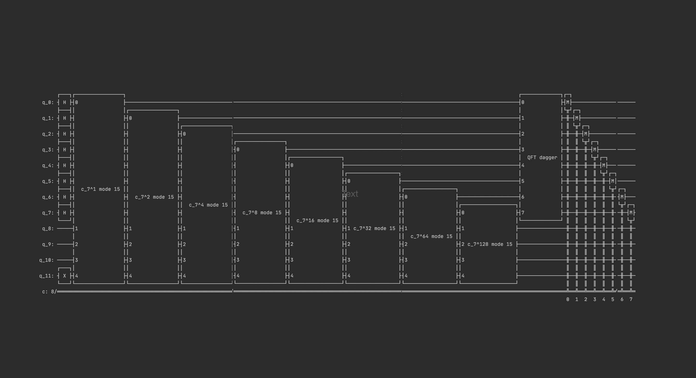

<!--
 * @Author: Zitian(Daniel) Tong
 * @Date: 2020-10-17 17:30:56
 * @LastEditTime: 2020-10-17 17:48:33
 * @LastEditors: Zitian(Daniel) Tong
 * @Description: 
 * @FilePath: /Quantum_Computing/README.md
-->
# Quantum Computing [](https://github.com/sindresorhus/awesome#readme)
> A repo to record my quantum computing learning

Welcome! In this repo, I will update some demo code for performing quantum computing.

## Configuring Your Environment

1. [Install PennyLane](https://pennylane.ai/qml/) </br>
a cross-platform Python library for quantum machine learning, automatic differentiation, and optimization of hybrid quantum-classical computations.

```shell
# install the latest released version of PennyLane
pip install pennylane --upgrade
```

2. [PennyLane Doc](https://pennylane.readthedocs.io/en/stable/code/qml.html)</br>
Use this link to see more detailed about the classes and quantum operation

3. [install Qiskit](https://qiskit.org/documentation/getting_started.html)
Use the above hyperlink to checkout the Qiskit installation procedures

Recommded Environment: Anaconda

## Project Description
1. [Shor's Algorithm](main.py) </br>
-> goto **main.py**  </br> </br>

